# Security & Performance Audit — `time-tracker-app`

**Date:** 2026-05-09
**Auditor:** Architect mode
**Scope:** Full codebase review of the React + Firebase time-tracker SPA, including Firestore rules, deployment config, and dependencies.

---

## Executive summary

The application demonstrates a thoughtful baseline of defensive coding (input sanitization helpers, CSV-injection escaping, Firestore rules with field validation, error boundary, security headers in [`netlify.toml`](../netlify.toml:14)). The previous remediation pass documented in [`SECURITY_AND_PERFORMANCE_IMPROVEMENTS.md`](../SECURITY_AND_PERFORMANCE_IMPROVEMENTS.md:1) covered most of the obvious low-hanging fruit.

This audit identifies **15 security issues** and **14 performance issues** still outstanding, plus **5 operational gaps**. The most urgent items are:

| Severity | Count | Examples |
|----------|-------|----------|
| CRITICAL | 1 | API key checked into `.env` and likely git history |
| HIGH | 6 | Public-share rules allow unauthenticated reads; CSP allows `'unsafe-inline'`; unbounded Firestore listener |
| MEDIUM | 13 | Denylist sanitization; missing App Check; missing pagination; large-list rendering cost |
| LOW | 15 | Header polish, dependency hygiene, CRA → Vite migration, observability |

---

## 1. Threat model recap

- **Trust boundary:** Browser ↔ Firebase (Firestore + Auth). No custom backend.
- **Identities:** Anonymous Firebase Auth users (default) and Google-federated users.
- **Sensitive data:** Ticket IDs (may contain customer/project names), session notes (may contain proprietary task descriptions), user display name, photo URL, Google UID.
- **Assets at risk:** Tenant data isolation in Firestore; CSV/JSON exports opened in spreadsheet tools; XSS via stored notes; bundle integrity.

---

## 2. Security findings

### SEC-1 — CRITICAL — Firebase API key committed to repository
**Location:** [`.env`](../.env:6)
The actual production Firebase Web API key (`AIzaSy…`) is stored in `.env`. While `.env` is in [`.gitignore`](../.gitignore:16), the value has likely been seen by anyone who cloned during early development, and the literal value appears in `git log -p` if it was ever staged. Firebase Web API keys are **not** secrets in the OAuth sense (they identify the project, not authorize bearer access), but a leaked key combined with permissive Firestore rules or an unrestricted GCP API key can be abused for quota exhaustion or Auth abuse.

**Recommendation:**
1. Rotate the key in Firebase Console → Project settings → Web apps.
2. In Google Cloud Console → APIs & Services → Credentials, set:
   - **Application restrictions:** HTTP referrers (`https://your-domain/*`, `http://localhost:3000/*`).
   - **API restrictions:** Identity Toolkit API, Firebase Installations API, Cloud Firestore API only.
3. Purge the value from git history with `git filter-repo` or BFG (and force-push if acceptable).
4. Remove the misleading `decodeIfBase64` wrapper in [`src/App.jsx`](../src/App.jsx:31) — base64 obfuscation is not a security control.

---

### SEC-2 — HIGH — Public-share Firestore rules allow anonymous reads
**Location:** [`firestore.rules`](../firestore.rules:93)
```
allow read: if true;
```
The path `artifacts/{appId}/public/data/{shareId}/time_entries/{entryId}` is readable by anyone in the world if they can guess or are given a `shareId`. There is no rate limit, no audit log, and no expiry. The current `shareId` is generated client-side (no entropy guarantees in the rules).

**Recommendation:**
- Require authentication: `allow read: if request.auth != null;`
- Consider Cloud Functions–generated signed share tokens with TTL stored in a `shares/{shareId}` doc and validated in rules.
- At minimum, require a minimum entropy `shareId` length (e.g., `shareId.size() >= 32`).

---

### SEC-3 — HIGH — `createdBy` is not enforced as immutable on update
**Location:** [`firestore.rules`](../firestore.rules:103)
The update rule checks `resource.data.createdBy == request.auth.uid` (the **existing** owner) but does not assert `request.resource.data.createdBy == resource.data.createdBy` — meaning the creator could rewrite the field with their own UID with no effect, but a future rule change permitting a wider write surface could allow ownership transfer. Defense-in-depth requires the immutability check now.

**Recommendation:**
```
allow update: if request.auth != null
              && resource.data.createdBy == request.auth.uid
              && request.resource.data.createdBy == resource.data.createdBy
              && validTimeEntryUpdate(request.resource.data);
```

---

### SEC-4 — HIGH — `appId` wildcard accepts any value as tenant scope
**Location:** [`firestore.rules`](../firestore.rules:61) and [`src/App.jsx`](../src/App.jsx:28)
```
match /artifacts/{appId}/users/{userId}/time_entries/{entryId} {
```
`{appId}` is a free wildcard. A malicious client could set their own path with any `appId`. Combined with `userId == request.auth.uid` it remains safe per-user, but the `appId` segment provides no security and adds confusion. The fallback default `'default-app-id'` in [`src/App.jsx`](../src/App.jsx:28) means anyone misconfiguring `REACT_APP_FIREBASE_APP_ID` lands in the same shared namespace.

**Recommendation:**
- Either drop the `{appId}` segment (`/users/{userId}/time_entries/{entryId}`) or pin it in rules: `match /artifacts/MY-APP-ID/users/{userId}/...`.
- Remove the `'default-app-id'` fallback; fail loudly if `REACT_APP_FIREBASE_APP_ID` is missing.

---

### SEC-5 — HIGH — Content-Security-Policy uses `'unsafe-inline'` for scripts
**Location:** [`netlify.toml`](../netlify.toml:23)
`script-src 'self' 'unsafe-inline' …` defeats the primary purpose of CSP against stored XSS. CRA injects an inline runtime bootstrap script, so removing `'unsafe-inline'` requires either a build-time hash extraction or migrating to Vite (where inline scripts can use `nonce`).

**Recommendation:**
- Short-term: switch to per-build hash CSP using a Netlify plugin (e.g., `netlify-plugin-csp-generator`) that hashes the CRA inline script.
- Long-term: migrate to Vite + nonce-based CSP.
- Add: `frame-ancestors 'none'`, `base-uri 'self'`, `form-action 'self'`, `object-src 'none'`, `upgrade-insecure-requests`.
- Tighten `style-src` similarly (Tailwind inlines no styles in production).

---

### SEC-6 — MEDIUM — Note sanitizer is denylist-based and bypassable
**Location:** [`src/utils/helpers.js`](../src/utils/helpers.js:38)
`sanitizeNote` strips `<`, `>`, `javascript:`, `data:`, `vbscript:`, `on\w+=`. This is a fragile denylist that misses:
- HTML entities (`&lt;script&gt;`)
- Unicode look-alikes (`＜script＞`, FULLWIDTH characters)
- Base64-encoded `data:` after the regex
- Future protocols (`blob:`, `filesystem:`)
- Markdown injection if notes are ever rendered as markdown

React's JSX **does** escape text content by default, so the runtime XSS risk for the current app is **low**. The real risk is downstream: when notes appear in CSV/JSON exports, AI prompt drafts, or any future render path that uses `dangerouslySetInnerHTML`.

**Recommendation:**
- Treat sanitization as **input validation** (length & allowlisted characters) rather than XSS defense.
- Document that all stored values must be rendered as plain text only — never `dangerouslySetInnerHTML`.
- Add unit tests confirming the helpers preserve safe Unicode and reject obvious payloads.

---

### SEC-7 — MEDIUM — Misleading base64 "decoding" of API key
**Location:** [`src/App.jsx`](../src/App.jsx:31)
The `decodeIfBase64` helper suggests the API key is somehow protected at rest. It is not — the bundle ships the decoded value verbatim. This pattern can mislead future maintainers.

**Recommendation:** Remove the helper; rely on Firebase API key restrictions and App Check (SEC-8).

---

### SEC-8 — MEDIUM — No Firebase App Check
**Location:** Firebase initialization at [`src/App.jsx`](../src/App.jsx:668)
Without App Check, any client (curl, Postman, third-party site) holding the Web API key can call Firestore as long as they can complete anonymous sign-in, hitting your read/write quota.

**Recommendation:** Enable App Check with reCAPTCHA Enterprise (web) and call `initializeAppCheck()` after `initializeApp()`.

---

### SEC-9 — MEDIUM — `localStorage` writes lack quota & sanitization symmetry
**Location:** [`src/App.jsx`](../src/App.jsx:551), [`src/components/TimerSection.jsx`](../src/components/TimerSection.jsx:57)
Reads validate length and shape; writes do not. A malicious browser extension could pollute `recentTicketIds` and the next read would still pass length validation but contain crafted payloads. Quota exceeded errors are not caught.

**Recommendation:**
- Apply the same `sanitizeTicketId` / length checks on write.
- Wrap `localStorage.setItem` in `try/catch` and silently no-op on `QuotaExceededError`.

---

### SEC-10 — MEDIUM — `appId` env value not validated at startup
**Location:** [`src/App.jsx`](../src/App.jsx:28)
String concatenation into Firestore paths without validation. Although Firestore SDK URL-encodes path segments, defense-in-depth dictates rejecting characters like `..`, `/`, or whitespace at startup.

**Recommendation:** Match `appId` against `^[a-zA-Z0-9_-]{1,64}$` and throw if invalid.

---

### SEC-11 — LOW — Header polish in `netlify.toml`
**Location:** [`netlify.toml`](../netlify.toml:14)

Add/remove:
- ❌ `X-XSS-Protection: 1; mode=block` — deprecated, browsers ignore or are unsafe; remove in favor of CSP.
- ✅ `Strict-Transport-Security: max-age=63072000; includeSubDomains; preload`
- ✅ `Cross-Origin-Opener-Policy: same-origin`
- ✅ `Cross-Origin-Resource-Policy: same-origin`
- ✅ `Content-Security-Policy: ... ; require-trusted-types-for 'script'` (requires Trusted Types adoption)

---

### SEC-12 — LOW — PII in client-side console logs
**Location:** Throughout [`src/App.jsx`](../src/App.jsx) — search for `console.error`
Raw Firebase error objects can include `path` and `data` fields that leak ticket IDs / notes into browser DevTools and any error tracker.

**Recommendation:**
- Wrap logging behind `if (process.env.NODE_ENV !== 'production')`.
- When piping to Sentry (OPS-2), use `beforeSend` to scrub `data`, `path`, and the `request.resource.data` field.

---

### SEC-13 — LOW — Google Sign-In domain restriction
**Location:** [`src/App.jsx`](../src/App.jsx:715)
If this app is intended for internal (single workspace) use, accept only emails from approved domains via a Cloud Function `beforeUserCreated` blocking trigger.

---

### SEC-14 — LOW — Outgoing image fetches
**Location:** [`src/App.jsx`](../src/App.jsx:2110), [`src/App.jsx`](../src/App.jsx:2123)
The Google logo at gstatic.com is fetched with a default referrer policy. Set `referrerPolicy="no-referrer"` consistently.

---

### SEC-15 — LOW — Dependency hygiene
- [`react-scripts 5.0.1`](../package.json:16) — last release 2022; receives no security patches. Deprecated transitive deps include `nth-check` < 2.0.1, `postcss` < 8.4.31 (already overridden, but `react-scripts` pins old versions).
- Run `npm audit --omit=dev` and document accepted CVEs.
- Plan migration to Vite (OPS-4).

---

## 3. Performance findings

### PERF-1 — HIGH — Unbounded Firestore listener on time entries
**Location:** [`src/App.jsx`](../src/App.jsx:826)
`query(getCollectionRef)` with no `orderBy`, `limit`, or pagination. As a user accumulates years of sessions, the snapshot delivers tens of thousands of docs on every reconnect, blowing out memory and Firestore read quota.

**Recommendation:**
- Add `orderBy('endTime', 'desc')` and `limit(200)` for the default view.
- Implement infinite scroll using `startAfter(lastDoc)`.
- Keep the active session subscription separate (it's already split when date filters are present).

---

### PERF-2 — HIGH — Listener effect dependency loop risk
**Location:** [`src/App.jsx`](../src/App.jsx:961)
```js
useEffect(() => { ... }, [isAuthReady, getCollectionRef, runningLogDocId, dateRangeStart, dateRangeEnd]);
```
`runningLogDocId` is set inside the same effect's snapshot callback. Each set triggers an unsubscribe + re-subscribe — slow and wasteful, with potential to miss updates.

**Recommendation:** Remove `runningLogDocId` from the dep array; manage the active-session detection purely from the snapshot.

---

### PERF-3 — MEDIUM — Timer interval re-creates every milestone
**Location:** [`src/App.jsx`](../src/App.jsx:964)
Deps include `activeLogData` and `timerMilestone`, both of which mutate during a session. Every milestone fires a new `setInterval` (and clears the prior). Race conditions can drop a tick.

**Recommendation:**
- Move milestone tracking into a `useRef<Set<number>>()`.
- Only depend on `isTimerRunning` and `runningLogDocId`.

---

### PERF-4 — MEDIUM — `filteredAndGroupedLogs` recomputes too aggressively
**Location:** [`src/App.jsx`](../src/App.jsx:1035)
The memo depends on `ticketStatuses`, whose object reference changes on every snapshot even when the underlying values are identical (line 771: `setTicketStatuses(statuses)` always builds a fresh object).

**Recommendation:**
- Use a `useEqualityRef` pattern or compare the new map shallowly before calling `setTicketStatuses`.
- Pre-bucket logs by `ticketId` once and re-derive subtotals incrementally.

---

### PERF-5 — MEDIUM — `AnimatePresence` + `motion.div layout` over the full list
**Location:** [`src/components/SessionList.jsx`](../src/components/SessionList.jsx:228)
`react-window` is already in dependencies but unused. `framer-motion`'s layout animations measure every child each render — costly with hundreds of tickets.

**Recommendation:**
- Wrap the list in `react-window`'s `VariableSizeList`.
- Disable layout animations for off-screen rows; keep entrance animations only.

---

### PERF-6 — MEDIUM — `localStorage` write per snapshot
**Location:** [`src/App.jsx`](../src/App.jsx:589)
Every Firestore snapshot triggers `setRecentTicketIds` and a localStorage write, even if the content hasn't changed.

**Recommendation:**
- Compare next array to prior with a shallow equal before writing.
- Use a debounce or write only on session start.

---

### PERF-7 — MEDIUM — Write-batch limits on rename
**Location:** [`src/App.jsx`](../src/App.jsx:1445)
Firestore caps `writeBatch` at 500 ops. A long-lived ticket can exceed this.

**Recommendation:** Chunk into multiple commits:
```js
for (const chunk of chunks(docs, 450)) { const b = writeBatch(db); chunk.forEach(...); await b.commit(); }
```

---

### PERF-8 — LOW — Two parallel snapshot subscriptions when filtering
**Location:** [`src/App.jsx`](../src/App.jsx:927)
With date constraints, the code maintains a ranged listener AND an active-session listener. SDK v12 supports `or()` queries; consolidate.

---

### PERF-9 — LOW — Synchronous JSON export blocks main thread
**Location:** [`src/App.jsx`](../src/App.jsx:1567)
`JSON.stringify(jsonData, null, 2)` over thousands of rows can block for hundreds of ms.

**Recommendation:** Run inside `requestIdleCallback`, or stream rows into a `Blob` part array.

---

### PERF-10 — LOW — Bundle bloat from `framer-motion`
~60kb gzip for entrance/layout animations that could be CSS keyframes.

**Recommendation:** Run `source-map-explorer build/static/js/*.js`. Replace simple animations with Tailwind `animate-*` utilities.

---

### PERF-11 — LOW — Code-splitting opportunities
Modals, instructions, and the export menu are loaded eagerly. `React.lazy` + `<Suspense>` would cut initial bundle.

---

### PERF-12 — LOW — `reportWebVitals()` wired with no callback
**Location:** [`src/index.js`](../src/index.js:17)
Either remove or wire to your analytics.

---

### PERF-13 — LOW — Eagerly loaded GSI script
**Location:** [`public/index.html`](../public/index.html:27)
`signInWithPopup` does not need the One-Tap GSI client. ~40kb saved by removing.

---

### PERF-14 — LOW — `db` in many memo/callback deps
`db` is set once after init but lives in `useState`. Storing it in a ref or a module-level mutable will let callbacks be created once.

---

## 4. Operations / quality findings

| ID | Severity | Item |
|----|----------|------|
| OPS-1 | MEDIUM | No tests for security helpers (`sanitizeTicketId`, `sanitizeNote`, `escapeCSV`). Add Firestore-rules tests via `@firebase/rules-unit-testing`. |
| OPS-2 | MEDIUM | No remote error tracking. Wire `ErrorBoundary` and the `console.error` sites to Sentry/Logflare. |
| OPS-3 | LOW | Add `firebase.json` `firestore.indexes` block. Date-range queries require composite indexes that should be version-controlled. |
| OPS-4 | LOW | CRA → Vite migration plan; unblocks nonce-based CSP and modern security patches. |
| OPS-5 | LOW | Add `SECURITY.md` with disclosure email, supported versions, scope. |

---

## 5. Recommended remediation roadmap

```mermaid
flowchart LR
  subgraph P0 [Now - this sprint]
    A1[SEC-1 Rotate API key + key restrictions]
    A2[SEC-2 Auth-gate public reads]
    A3[SEC-3 Immutable createdBy]
    A4[PERF-1 Add limit + orderBy]
  end
  subgraph P1 [Next sprint]
    B1[SEC-5 Hash/nonce CSP]
    B2[SEC-8 Firebase App Check]
    B3[PERF-2 Stabilize listener]
    B4[PERF-5 Virtualize list]
    B5[OPS-1 Helper unit tests + rules tests]
  end
  subgraph P2 [Backlog]
    C1[OPS-4 Migrate to Vite]
    C2[PERF-10/11/13 Bundle trim]
    C3[OPS-2 Sentry integration]
    C4[OPS-5 SECURITY.md]
  end
  P0 --> P1 --> P2
```



---

## 6. Validation plan

After remediation, verify with:

- `npm audit --omit=dev` → zero high/critical
- `firebase emulators:exec --only firestore "npm run test:rules"` → rules tests pass
- Lighthouse CI in production → Performance ≥ 90, Best Practices ≥ 95
- `npx @cyclonedx/cyclonedx-npm` → SBOM generated for supply-chain review
- Manual: try to write to `artifacts/foo/users/{otherUid}/time_entries/x` while signed in as a different UID → expect denial
- Manual: open CSV export with cell starting `=cmd|...` in Excel → expect inert text
